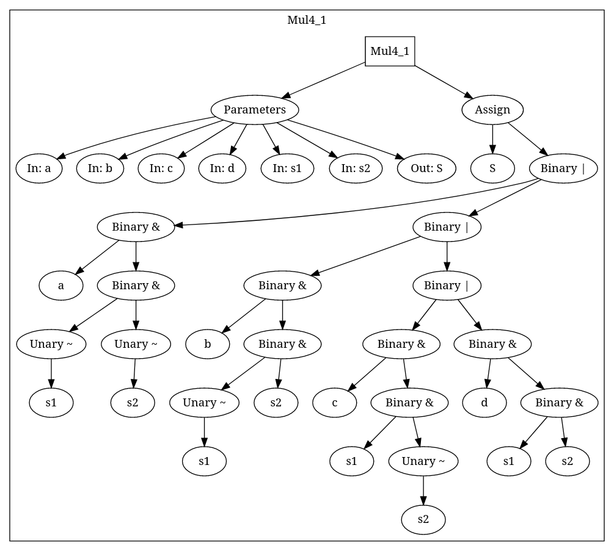

# Házi feladat

Programozás alapjai 2  
Specifikáció  
Pektor Ervin  
GR7EK7  
2022. április 03.

# Feladat

A feladat egy Verilog-szerű hardverleíró nyelv (innentől Factolog) készítése. A nyelvnek csak aszinkron hálókkal kell tudnia dolgozni. A bemenet egy szöveges fájl, amely factolog nyelven írt programot tartalmaz, a kimenet a megtervezett hardver absztrakt szintaxisfája dot nyelven és/vagy a [Factorio](https://www.factorio.com/) nevű játékhoz tervrajz tömörítés és kódolás nélkül.

# Specifikáció

## Nyelv felépítése

A nyelvnek a felépítése a következő:

    main := async_module+

    async_module := "async module" identifier "(" parameter_list_declaration? "){" async_expression+ "}"

    identifier := (\alpha | "_") (\alnum | "_")*

    async_expression := var_declaration | module_connection | assignment

    var_declaration := "var" identifier ("," identifier)* ";"
    module_connection := identifier "(" parameter_list ");"
    assignment := identifier "=" expression ";"

    parameter_list_declaration := direction identifier ("," direction identifier)*;
    direction := "in" | "out"

    parameter_list := value ("," value)*

    expression := term ( ("+" | "-" | "&" | "|" | "^") term )*
    term := factor ( ("*" | "/" | "%" | "<<" | ">>") factor )*
    factor := unary_expression ( "**" unary_expression )*
    unary_expression := unary_operator? ( "(" expression ")" | value )

    value := \num | identifier

    binary_operator := "+" | "-" | "*" | "/" | "%" | "<<" | ">>" | "&" | "|" | "^"

    unary_operator := "~" | "-" | "+"

Ahol a literálisok idézőjelek között vannak, `*`-gal jelzett lexémák nullszor vagy többször szügségesek, a `+`-szal jelzettek legalább egyszer. A zárojelek csoportosításra szolgálnak. A `|` a VAGY utasítás, vagy a bal oldali lexéma vagy a jobboldali lexémát várja. A `<<` illetve `>>` shiftelést, a `%` modulo, a `^` XOR műveleteket jelölnek. A programban a `//` jelektől a sor végéig tartó kommentet jelöl.

## Példa bemenet

Alább látható egy példa program amely egy 4/1 multiplexert valósít meg
   
    //4/1 multiplexer example
    async module Mul4_1(in a, in b, in c, in d,
                        in s1, in s2, out S){
        S = (a & ~s1 & ~s2) | 
            (b & ~s1 &  s2) |  
            (c &  s1 & ~s2) | 
            (d &  s1 &  s2) ; 
    }

## Példakimenet

### Absztrakt szintaxisfa

    graph G{
        subgraph cluster_0x5575799b6400{
            label="Mul4_1";
            "0x5575799b6400" [label="Mul4_1",shape=box];
            "0x5575799b64e0" [label="Parameters",];
            "0x5575799b6890" [label="In: a",];
            "0x5575799b64e0" -> "0x5575799b6890";
            "0x5575799b6970" [label="In: b",];
            "0x5575799b64e0" -> "0x5575799b6970";
            "0x5575799b6d00" [label="In: c",];
            "0x5575799b64e0" -> "0x5575799b6d00";
            "0x5575799b6c00" [label="In: d",];
            "0x5575799b64e0" -> "0x5575799b6c00";
            //[Snip..]
        };
    }

A kimenet Graphviz-zel megjelenítve:

### Factorio tervrajt

A tervrajzak kompatibilisnek kell lennie a [Factorio](https://www.factorio.com/) nevű játékkal. A tervrajzok részletes leírása [itt](https://wiki.factorio.com/Blueprint_string_format) található.

## IO

A programnak parancssorból kell működnie és képesnek kell lennie mind fájlból, mind a standard bemenetről olvasnia. A kimenetet fájlba, vagy a standard outra kell kiírni.

## Hibakezelés

A programnak tudnia kell kezelni a hibás bemeneteket, mind szintaktikai, mind szemantikai értelemben. Hiba esetén a program figyelmezteti a programozót, majd kilép.

# Testelés

A program tesztelésére unit teszteket kell készíteni. Ezeknek mind helyes és helytelen bemeneteket is tartalmazniuk kell. Integration tesztelést is kell végezni.
